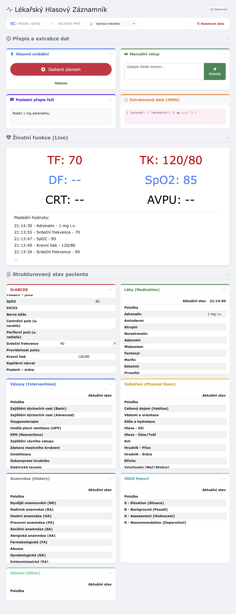

# 🏥 Automonitoring with AI

Inteligentní monitorovací systém se zpracováním hlasu pomocí AI.

## 📊 Architektura systému

```
🎤 Mikrofon
   ↓
🔊 ASR (Vosk, Whisper, Groq)
   ↓
📄 Text
   ↓
🧠 LLM (Ollama: gemma3, deepseek-r1)
   ↓
📦 JSON struktura
   ↓
🌐 Web Dashboard (Real-time)
   ↓
📈 CSV Export + Timestamps
```



---

## 🚀 Rychlý start

### Instalace Ollama

1. Stáhni [Ollama](https://ollama.com/download)
2. Nainstaluj model:
   ```bash
   ollama run gemma3
   ```

**Dostupné modely:**
| Model | Velikost | VRAM | Rychlost |
|-------|----------|------|----------|
| gemma3:1b | 815 MB | ~1 GB | Nejrychlejší ⚡ |
| gemma3:4b | 4.4 GB | ~2 GB | Vyvážené |
| deepseek-r1:1.5b | 1.1 GB | ~1 GB | Rychlé 🚀 |

Zobrazit nainstalované modely:
```bash
ollama list
```

---

## 🐍 Python Virtual Environment

```bash
# 1. Vytvoř složku
mkdir mujprojekt && cd mujprojekt

# 2. Virtuální prostředí
python3 -m venv venv

# 3. Aktivuj
source venv/bin/activate

# 4. Instaluj balíčky
pip install -r requirements.txt

# 5. Ulož závislosti (volitelné)
pip freeze > requirements.txt

# 6. Deaktivuj
deactivit
```

---

## 🎙️ Whisper (ASR)

[Whisper - OpenAI Speech Recognition](https://github.com/openai/whisper)

### Parametry modelů

| Model | Parametry | Vyžadován VRAM | Rychlost |
|-------|-----------|---|----------|
| tiny | 39 M | ~1 GB | 10x |
| base | 74 M | ~1 GB | 7x |
| small | 244 M | ~2 GB | 4x |
| medium | 769 M | ~5 GB | 2x |
| large | 1550 M | ~10 GB | 1x |
| turbo | 809 M | ~6 GB | 8x |

### Instalace

```bash
pip install git+https://github.com/openai/whisper.git
pip install pyaudio numpy
```

### Funkcionalita

- ✅ Záznam zvuku každých 5 sekund (nastavitelné)
- ✅ Dočasné uložení jako `.wav` soubory
- ✅ Transkripce textu
- ✅ Výstup do konzole

### Plánovaná vylepšení

- 🔄 Voice Activity Detection (VAD)
- ⏱️ Timestamps (časové značky)
- 📊 Metadata

**Poznámka:** Whisper defaultně používá FP16 pro rychlejší výpočty.

---

## 🎵 Vosk (Offline ASR)

Alternativa k Whisper - offline rozpoznávání řeči.

- 📦 [Vosk Toolkit](https://alphacephei.com/vosk/)
- 🗣️ [Vosk Models](https://alphacephei.com/vosk/models)

```bash
pip install vosk
```

### Konverze audio formátu

```bash
ffmpeg -i input_audio.wav -ac 1 -ar 16000 -acodec pcm_s16le converted_audio.wav
```

---

## 🔗 Groq API (Cloud LLM)

Cloudové LLM zpracování - rychlejší alternativa.

- 🌐 [Groq Console](https://console.groq.com/)

```bash
pip install groq

# Nastav API klíč
export GROQ_API_KEY=tvuj-api-klic
```

---

## 📁 Git Ignore

Systém ignoruje:

```
recordings/
logs/
venv/
.env
```

---

## 📝 Licence

MIT

## 👤 Autor

Jakub Vavra